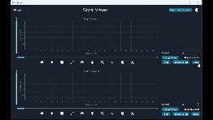

# Multi-Port, Multi-Signal Channel Signal Viewer

## Description

Monitoring vital signals is crucial in any ICU room. The Multi-Port, Multi-Signal Channel Signal Viewer is a desktop application built with PyQt and Qt Designer. It provides a user-friendly interface for browsing and visualizing multiple signals for medical signals such as ECG, EMG, EEG, etc, or nonmedical signals on your desktop. This README file provides an overview of the application's features, usage, and setup.
<div style="text-align: center;">
    
</div>

## Table of Contents
1. [Features](#features)
2. [Installation](#installation)
3. [Usage](#usage)
4. [Dependencies](#dependencies)
5. [Contributors](#contributors)
 ## Features

- **Signal Selection**: Browse your desktop to select signals for viewing.
- **Plotting**: Create and manage lists of selected signals for plotting.
- **Playback Control**: Play, pause, stop, replay, zoom in, zoom out, and reset view options for each signal.
- **Single-Click Activation**: Easily toggle individual signal activation with a single click.
- **Double-Click Activation**: Double-click to toggle the activation status of all signals.
- **Port Management**: Move signals between different port views for organization.
- **Synchronization**: Synchronize two ports to view the same signals simultaneously.
- **Control Actions**: Apply control actions to active signals across both ports.


## Installation
To install the project, clone the repository and install the requirements:

```bash
# Clone the repository
git clone https://github.com/omarshaban02/Signal-Viewer.git
```
```bash
# Navigate to the project directory
cd Signal-Viewer
```
```bash
# Install the required packages:
pip install -r requirements.txt
```
```bash
# Run the application:
python index.py
```

## Usage

1. **Selecting Signals:**
   - Click the "Open" button to navigate your desktop and select the signals you want to view.
   - The selected signals will appear in a list.
     
2. **Ploting Selected Signals:**
   - Choose the signals you want to plot from the list
   - Click the "Plot" button to plot it on the graph.
     
3. **Signal Activation:**
   - Single-click on a signal at the graph to activate it to control it.
   - Single-click again to deactivate it.
   - Double-click in any place in the graph to deactivate all signals.

4. **Port Views:**
   - Move active signals between port views.
   - Synchronize two ports to view signals simultaneously.

5. **Control Actions:**
   - Use the control buttons (Play, Pause, Stop, Replay, Zoom In, Zoom Out, Reset View) to interact with the selected signals.
   - Control actions can be applied to active signals or all signals, depending on your selection.
     
## Screenshots
### Light mode:

### Dark mode:

### Synchronized mode:


## Dependencies
This project requires the following Python packages listed in the `requirements.txt` file:
- PyQt5
- opencv
- numpy
- pandas

## Contributors <a name = "contributors"></a>
<table>
  <tr>
    <td align="center">
    <a href="https://github.com/AbdulrahmanGhitani" target="_black">
    
    <br />
    <sub><b>Abdulrahman Shawky</b></sub></a>
    </td>
<td align="center">
    <a href="https://github.com/omarnasser0" target="_black">
    
    <br />
    <sub><b>Omar Abdulnasser</b></sub></a>
    </td>
         <td align="center">
    <a href="https://github.com/AhmedKamalMohammedElSayed" target="_black">
    
    <br />
    <sub><b>Ahmed Kamal</b></sub></a>
    </td>
         <td align="center">
    <a href="https://github.com/AbdullahOmran" target="_black">
    
    <br />
    <sub><b>Abdullah Omran</b></sub></a>
    </td>
      </tr>
 </table>


<!--
 <h2>Features</h2>
The user can browse their PC to open any signal file. Each signal type should have examples of both normal and abnormal signals.
The application contains two main identical graphs. Each graph can display different signals, and the user can control each graph independently or link them together.
When a signal file is opened, it is displayed in cine mode, simulating a running signal over time.
The user can manipulate the running signals through various UI elements, including changing color, adding labels/titles, showing/hiding signals, controlling cine speed, zooming in/out, pausing/playing/rewinding signals, and scrolling/panning the signal in any direction.
Signals can be moved between graphs.
The application takes care of boundary conditions to ensure signals are displayed within appropriate ranges.
The user can generate reports of snapshots from the graphs, including data statistics such as mean, standard deviation, duration, minimum, and maximum values for each signal. The report is generated in PDF format directly from the code. -->
